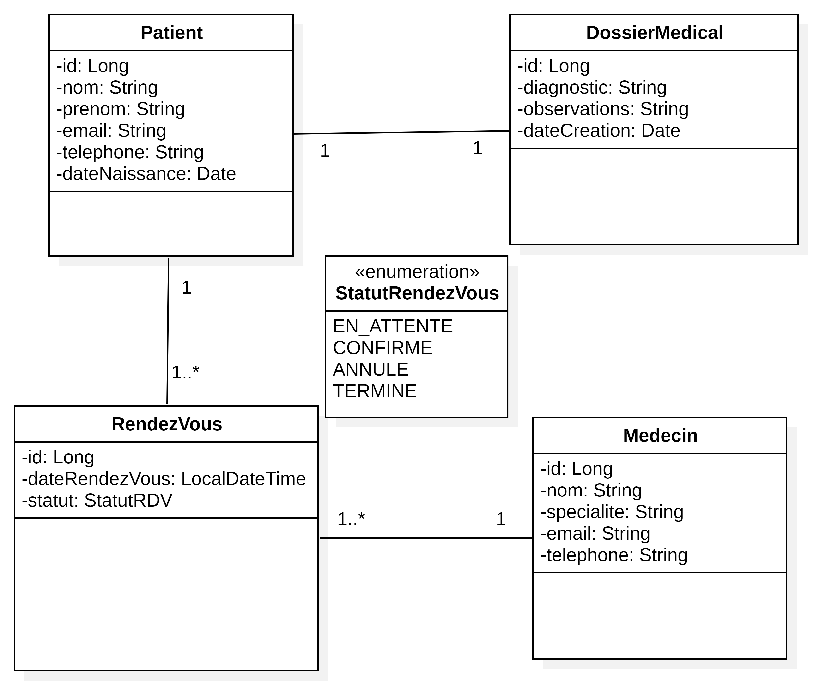
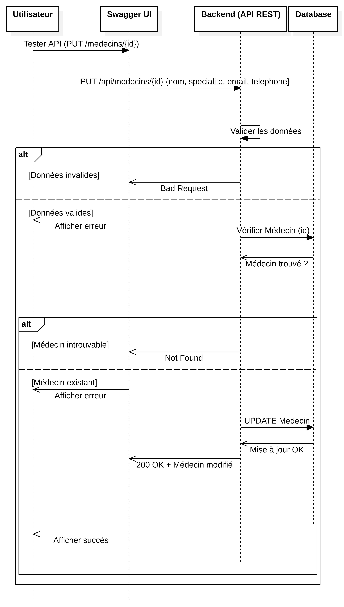
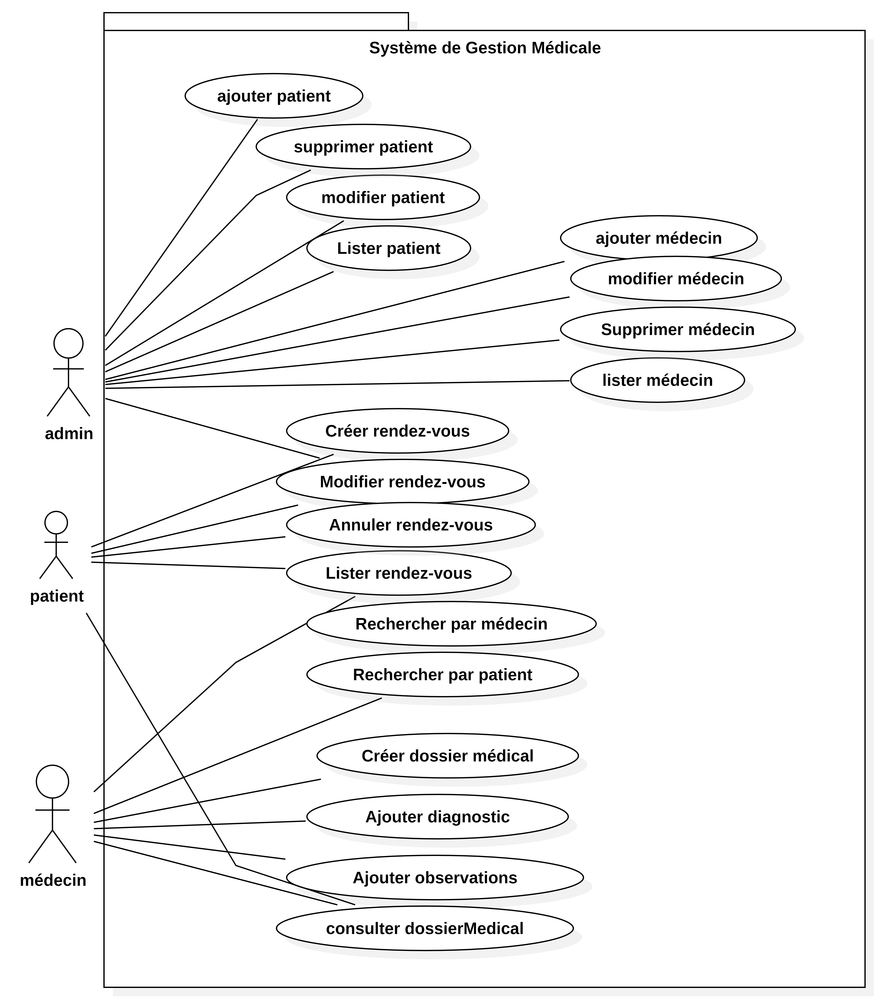
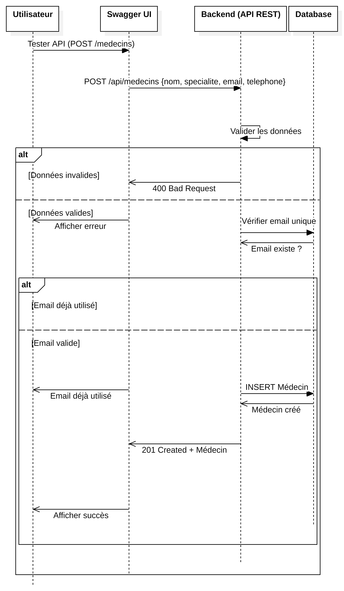
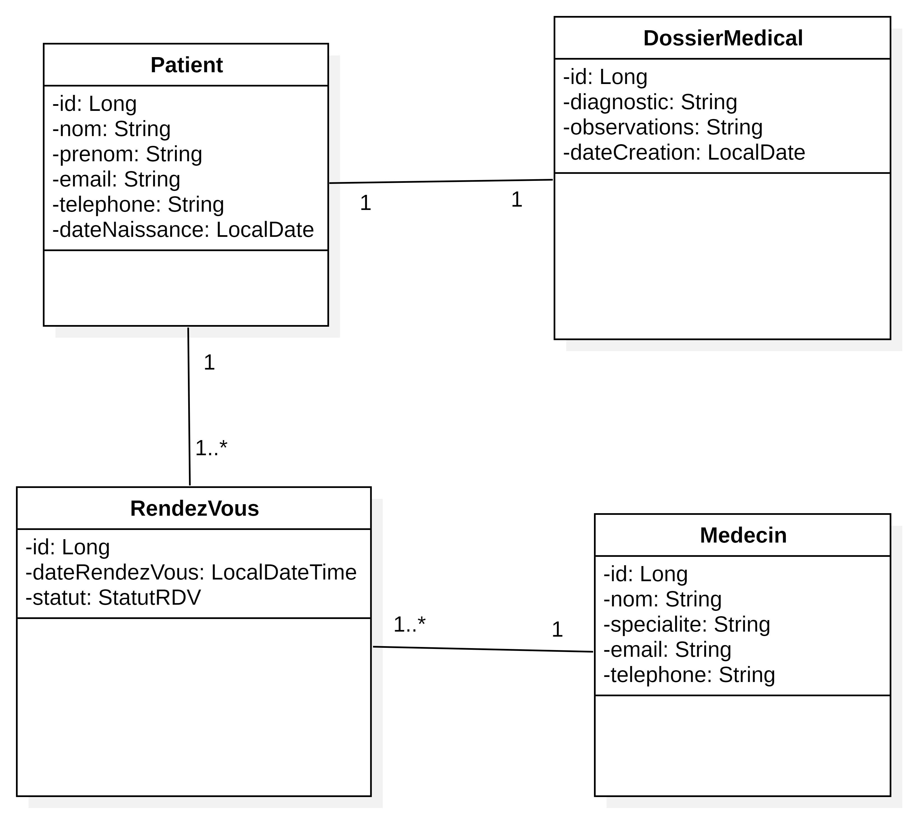

# brief-Syst-me-de-Gestion-M-dicale
Système de Gestion Médicale

Cette application est une API REST robuste développée avec Spring Boot 4, conçue pour automatiser la gestion des cliniques et des cabinets
médicaux. Elle permet de piloter efficacement les patients, les médecins, les rendez-vous et les dossiers médicaux.

Fonctionnalités Clés

- Gestion des Patients & Médecins : CRUD complet avec validation des données.
- Planification des Rendez-vous : Suivi des statuts (EN_ATTENTE, CONFIRMÉ, ANNULÉ, TERMINÉ).
- Dossiers Médicaux : Centralisation des diagnostics et observations par patient.
- Documentation Interactive : Intégration complète de Swagger/OpenAPI pour tester les endpoints.

Stack Technique

- Backend : Java 17, Spring Boot 
- Base de données : MySQL 8.0.
- Migration de données : Flyway (Versionnage du schéma SQL).
- Mapping & Productivité : MapStruct (DTOs), Lombok.
- Validation : Jakarta Validation (Bean Validation).
- Conteneurisation : Docker.

Installation et Lancement (Docker)

1. Prérequis
- Java 17+
- Docker & Docker Desktop

2. Build de l'application
   1 ./mvnw clean package -DskipTests

3. Déploiement via Docker

1 # Créer le réseau
 docker network create medical-net

2# Lancer la base de données
docker run -d --name mysql-db --network medical-net -e MYSQL_DATABASE=medical_db -e MYSQL_ROOT_PASSWORD=root -p 3306:3306 mysql:8.0

3# Build et lancer l'application
-docker build -t medical-app .
-docker run -d --name medical-app-container --network medical-net -p 8080:8080 -e
SPRING_DATASOURCE_URL="jdbc:mysql://mysql-db:3306/medical_db?createDatabaseIfNotExist=true" -e SPRING_DATASOURCE_USERNAME=root -e
SPRING_DATASOURCE_PASSWORD=root medical-app

API Documentation
Une fois l'application lancée, accédez à l'interface Swagger pour explorer les endpoints :
http://localhost:8080/swagger-ui/index.html

